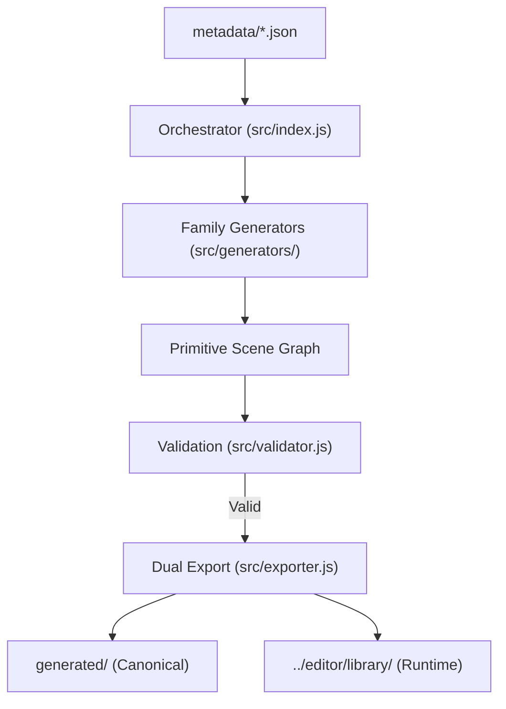

# Component Generation Engine (CGE)

The **Component Generation Engine (CGE)** is an offline, metadata-driven pipeline for the Circuit Crafter project. It is responsible for programmatically generating editable schematic symbols for hundreds of electronic components, replacing the legacy approach of hardcoding rendering logic in the main application.

---

## Architecture Principles

### 1. Engine / Renderer Separation
The system enforces a strict boundary between generation and runtime representation:
*   **Generation Engine (Offline)**: Parses metadata, computes geometry, applies family generators, validates against strict rules (e.g., the 20px grid), and exports static JSON. It does **not** handle any UI interaction, canvas rendering, or editor state.
*   **Editor Runtime (Main App)**: Dynamically fetches the generated JSON and renders it to the canvas. It does **not** compute symbol layouts.

### 2. Editable Primitives as the Source of Truth
We do **not** use opaque SVG `pathData` strings. Every visual aspect of a component is built from canonical, individually addressable **primitives** (`line`, `polyline`, `rect`, `arc`, `circle`, `text`, `pin`, `junction`).
*   **Why?** This ensures full editability in the future. It enables moving vertices, erasing lines, modifying symbols visually, and supports a future "Symbol Editor" mode where users can customize parts directly on the canvas.

### 3. Dual Output Layers
To prevent lock-in and preserve canonical data, the exporter produces two formats:
*   **Engine Source Format (`generated/`)**: The definitive source of truth. It includes the full generator metadata, timestamps, generator family strings, and source references. This allows for future regeneration, translation, and automated symbol editing.
*   **Runtime Editor Format (`../editor/library/`)**: A stripped-down, lightweight version optimized for fast loading and low memory footprint in the browser. Engine-specific metadata is removed.

---

## The Generation Pipeline



1.  **Scan**: The orchestrator (`index.js`) recursively scans the `metadata/` directory for `.json` component definitions.
2.  **Generate**: Based on the `family` field in the metadata, the corresponding Generator script is invoked. The generator returns an array of Primitives and Pins.
3.  **Validate**: The output is run through the strict `validator.js` pipeline.
4.  **Export**: If validation passes, the component is exported to both output layers, and the master `catalog.json` is updated.

---

## Generator Families

Generators encode the parametric rules for drawing specific classes of components.

*   **`TwoPinGenerator.js`**: Designed for passive components. Uses `symbolStyle` (e.g., `zigzag`, `capacitor`, `inductor`, `diode`, `led`, `fuse`) to generate the corresponding geometries. The signal line is always grid-aligned at `Y=20`.
*   **`ThreePinGenerator.js`**: Handles 3-pin devices like sensors (LM35), BJT/FET transistors, and voltage regulators (78xx).
*   **`DipIcGenerator.js`**: The flagship generator that automatically creates DIP IC packages. It calculates the required height based on pin count, spaces pins at exact 20px intervals, draws the IC notch, and handles pin labels. It natively supports **active-low signal detection** (e.g., converting `CS/` or `/RESET` into standard labels with inversion bubbles). **Update:** Employs standard counter-clockwise pin numbering (bottom-to-top on the right side) to strictly match physical IC layouts (e.g. 555 Timer).
*   **`LogicGateGenerator.js` (implicit via heuristics)**: Logic gates are generated without physical power pins (`VCC`/`GND`) to strictly align with US/India standard schematic conventions, keeping circuit diagrams uncluttered.
*   **`ConnectorGenerator.js`**: Handles single-sided headers and dual-sided terminal blocks, automatically scaling height based on the number of specified pins.

---

## Primitive Schema

All geometry is defined via the factory functions in `src/primitives.js`. Every primitive receives a globally unique `id` during generation.

*   **`line`**: `x1`, `y1`, `x2`, `y2`, `stroke`, `strokeWidth`, `lineCap`
*   **`polyline`**: `points` (array of `[x,y]`), `stroke`, `strokeWidth`, `fill`, `lineCap`, `lineJoin`
*   **`rect`**: `x`, `y`, `width`, `height`, `stroke`, `fill`, `strokeWidth`
*   **`arc`**: `cx`, `cy`, `radius`, `startAngle`, `endAngle`, `stroke`, `fill`, `strokeWidth`, `anticlockwise`
*   **`circle`**: `cx`, `cy`, `radius`, `stroke`, `fill`, `strokeWidth`
*   **`text`**: `x`, `y`, `content`, `fontSize`, `fontFamily`, `align`, `baseline`, `fill`
*   **`pin`**: `name`, `number`, `side` (`left`|`right`|`top`|`bottom`), `position` (`{x, y}`), `electricalType`, `length`, `invert` (boolean for active-low bubble)
*   **`junction`**: `x`, `y`, `radius`

---

## Validation Rules (`validator.js`)

Before a component can be exported, it must pass a strict validation pipeline to ensure compatibility with the Editor runtime's snapping and routing engines.

1.  **Global Uniqueness**: No two components can share the same `id`.
2.  **Pin Uniqueness**: No two pins within a component can share the same `id` or `number`.
3.  **Grid Compliance**: The `Y` coordinate for all `left` and `right` side pins **must** be a multiple of `20`. The `X` coordinate for `top` and `bottom` side pins must also be a multiple of `20`.
4.  **Strict Center Snapping**: To guarantee that pins land exactly on the editor's 20px grid, the component's **bounding box dimensions (width and height) MUST be multiples of 40**. This ensures the geometric center (`w/2`, `h/2`) falls on a 20px boundary.
5.  **Pin Lengths**: The default outward pin length is explicitly set to `20px` to bridge from the component edge to the nearest grid intersection.
6.  **Bounds Checking**: All pin coordinates must fall strictly on the edges of the bounding box defined by `dimensions`. (e.g., A `left` pin must have `x=0`).
7.  **Label Overlap**: Warnings are generated if two pins share the exact same `side` and coordinate.
6.  **Schema Validity**: All primitives must belong to the allowed types and contain the required geometric properties.

---

## Usage

### Requirements
*   Node.js v14+ (Uses ES Modules `"type": "module"`)
*   Zero external dependencies (No `npm install` needed)

### Scripts
Run these from within the `ComponentsGenerating-Engine/` directory:

```bash
# Generate all components and export them to both output layers
npm run generate

# Run the validation pipeline only, without writing files (useful for CI/CD)
npm run validate
```

---

## Directory Structure

```text
ComponentsGenerating-Engine/
├── package.json
├── src/
│   ├── index.js                  # Main Orchestrator
│   ├── primitives.js             # Factory functions for the primitive schema
│   ├── validator.js              # Strict validation rule engine
│   ├── exporter.js               # Dual output and catalog generator
│   └── generators/
│       ├── TwoPinGenerator.js    # Resistors, Capacitors, Diodes, etc.
│       ├── ThreePinGenerator.js  # Sensors, Transistors, Regulators
│       ├── DipIcGenerator.js     # Standard ICs (8051, ADC0804, etc.)
│       └── ConnectorGenerator.js # Headers and terminal blocks
├── metadata/                     # Input JSON specifications, grouped by category
│   ├── passives/
│   ├── sensors/
│   └── ics/
└── generated/                    # Output (Engine Source Format - Canonical)
```

---

## Future Extensibility

The CGE is designed to be the foundational automation layer for Circuit Crafter. Planned future enhancements include:
*   **Bulk Generation via `metadata-builder.js`**: Parsing the 500+ component library PDF or CSVs into metadata JSONs programmatically.
*   **Datasheet Extraction**: Generating pin definitions automatically from scraped datasheet tables.
*   **AI-Assisted Layout**: Using AI to intelligently group functionally related pins (e.g., grouping SPI or I2C pins together on ICs) rather than strict numerical ordering.
